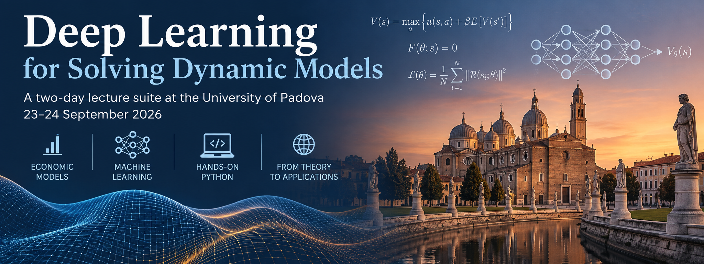

<p align="center">

</p>

# Deep Learning for Solving Dynamic Models

A two-day lecture suite held at the **University of Padova**, **23–24 September 2026**.

---

## Purpose of the lectures

* This course is designed for Ph.D. students and researchers in economics, finance and related
  disciplines. It introduces recent advances in machine learning and computational science for
  **solving and estimating dynamic stochastic economic models**.
* Classical grid-based methods, projection, value-function iteration, perturbation, break down once
  a model has many state dimensions, overlapping generations, occasionally binding constraints, or
  continuous-time dynamics. This course teaches a toolbox built for exactly those models.
* The unifying idea is simple: **let the economics drive the learning problem**. Equilibrium
  conditions, Bellman equations and PDEs become the residual loss (Deep Equilibrium Nets,
  Physics-Informed Neural Networks), or they shape the simulator that generates the training data a
  deep surrogate or Gaussian process then learns.
* Each method is built from scratch on a benchmark where the answer is known, Brock–Mirman,
  cake-eating, Black–Scholes, before being applied to models where it is not: IRBC, 56-cohort OLG,
  continuous-time Aiyagari. Where a model does not solve at classroom scale, the notes say so and
  point at the code that does.
* The format is interactive and workshop-like, combining theory with hands-on coding in Python.

## Prerequisites

Please arrive with these in place, the ten hours are reserved for method content.

* Basic econometrics.
* Basic programming in Python. See [QuantEcon](https://python-programming.quantecon.org/intro.html)
  for a thorough introduction.
* A brief Python refresher is provided [here](python_refresher), and a Jupyter introduction
  [here](python_refresher/jupyter_intro.ipynb). **Please work through these before the course.**
* Basic calculus and probability. [Mathematics for Machine Learning](https://mml-book.github.io/)
  covers what is assumed.

## Class enrollment on the [Nuvolos Cloud](https://nuvolos.cloud/)

* All lecture materials (slides, codes and further readings) are distributed via the
  [Nuvolos Cloud](https://nuvolos.cloud/), where the full Python environment is pre-installed.
* To enroll in this class, please click on this
  [enrollment key](https://app.eu1.nuvolos.cloud/enroll/class/Gmqu2SnFAsE), and follow the steps.

### Nuvolos support

- Nuvolos Support: <support@nuvolos.cloud>

### Running the notebooks on your own machine

Python 3.10–3.12. No GPU is needed: every notebook runs on a CPU, and the heaviest ones expose a
`RUN_MODE` switch (`"smoke"` / `"teaching"` / `"production"`) that bounds epochs and sample sizes.

```bash
git clone https://github.com/sischei/deep_learning_padova_0926.git
cd deep_learning_padova_0926

python -m venv .venv
source .venv/bin/activate          # Windows: .venv\Scripts\activate

pip install --upgrade pip
pip install -r requirements.txt

python -m ipykernel install --user --name padova --display-name "Padova 2026"
jupyter lab
```

Then open any notebook and pick the **Padova 2026** kernel. To check that the install worked:

```bash
python -c "import tensorflow, torch, sklearn; print(tensorflow.__version__, torch.__version__)"
```

On Apple Silicon, `pip install tensorflow` pulls the arm64 wheel; `tensorflow-metal` is not needed for
anything taught here. The exact package list is in [`requirements.txt`](requirements.txt).

---

## Schedule

### [Day 1](day1), Wednesday, 23 September 2026

| **Time** | **Session** | **Slides** | **Code** |
|---|---|---|---|
| 09:00 – 10:30 | **1.** Introduction to machine learning and deep learning | [slides](day1/slides/01_Intro_to_DeepLearning.pdf) | [code](day1/code/01_deep_learning_intro) |
| 10:30 – 10:45 | *Coffee break* | | |
| 10:45 – 12:00 | **2.** Deep Equilibrium Nets: the method and the Brock–Mirman benchmark | [slides](day1/slides/02_DeepEquilibriumNets.pdf) | [code](day1/code/02_deep_equilibrium_nets) |
| 12:00 – 13:30 | *Lunch break* | | |
| 13:30 – 14:25 | **3.** Neural architecture search and loss balancing | [NAS](day1/slides/03a_Neural_Architecture_Search.pdf) · [loss balancing](day1/slides/03b_Loss_Balancing.pdf) | [code](day1/code/03_nas_loss_balancing) |
| 14:25 – 15:25 | **4.** Overlapping generations with DEQNs | [slides](day1/slides/04_OLG_Models_DEQNs.pdf) | [code](day1/code/04_olg) |
| 15:25 – 15:40 | *Coffee break* | | |
| 15:40 – 16:30 | **5.** Scaling up: the international real business cycle model | [slides](day1/slides/05_IRBC.pdf) | [code](day1/code/05_irbc) |

### [Day 2](day2), Thursday, 24 September 2026

| **Time** | **Session** | **Slides** | **Code** |
|---|---|---|---|
| 09:00 – 09:50 | **6.** Deep surrogates and Gaussian processes | [slides](day2/slides/06_Deep_Surrogates_and_GPs.pdf) | [code](day2/code/06_surrogates_and_gps) |
| 09:50 – 10:05 | *Coffee break* | | |
| 10:05 – 11:00 | **7.** Structural estimation via simulated method of moments | [slides](day2/slides/07_Structural_Estimation_SMM.pdf) | [code](day2/code/07_structural_estimation) |
| 11:00 – 14:00 | *Break* | | |
| 14:00 – 14:55 | **8.** Economics-informed neural networks: foundations | [slides](day2/slides/08_PINNs_Foundations.pdf) | [code](day2/code/08_pinns) |
| 14:55 – 15:10 | *Coffee break* | | |
| 15:10 – 16:00 | **9.** PINNs: economic and financial applications; hands-on, build a PINN from scratch; course wrap-up | [slides](day2/slides/09_PINNs_Applications.pdf) · [wrap-up](day2/slides/10_Wrap_Up.pdf) | [code](day2/code/09_pinns_applications) · [exercise](day2/code/09_pinns_applications/09_04_PINN_Exercise.ipynb) |

---

## What each session covers

**1. Introduction to machine learning and deep learning.** Classical ML and the bias–variance
trade-off; gradient descent, SGD, momentum and Adam; MLPs, depth, width and activation choices;
regularization and the double-descent phenomenon; the curse of dimensionality on Genz test functions;
TensorFlow and PyTorch side by side.

**2. Deep Equilibrium Nets.** Why grid-based methods hit a wall. The DEQN training principle:
equilibrium residuals as an unsupervised loss on a simulated state distribution. Deterministic
Brock–Mirman with a closed-form check, then stochastic Brock–Mirman with Gauss–Hermite quadrature for
the conditional expectation. Occasionally binding constraints via Fischer–Burmeister complementarity,
and a deliberate choice of loss kernel.

**3. Architecture search and loss balancing.** The engineering session, and it comes early because
everything after it depends on it. Grid versus random search, measured rather than asserted; random
search and successive halving implemented in pure Python with an exact epoch budget, on a Genz
testbed and then on the Brock–Mirman DEQN with the Euler error as the score. Why multi-equation
residual losses on different scales silently kill training, measured through the gradient each
component sends; why writing residuals in natural units comes first and what inverse-loss weighting
and ReLoBRaLo can add after that.

**4. Overlapping generations.** The session built for Padova's own research focus, and the one with
the most time. It opens with Diamond's two-period model, one decision and one Euler equation, derived
and solved by hand and then by a sixty-line network, before the six-cohort Krueger–Kübler model, where
the closed-form savings rate is derived by backward induction and the two assumptions behind it are
named: log utility, and no future labor income. The step from a sequence equilibrium to a recursive
one, which every DEQN relies on, is made explicit. The trained network is validated against the closed
form cohort by cohort, at every income level. The session closes on the 56-cohort benchmark of
Azinovic, Gaegauf and Scheidegger (2022), which drops both assumptions, with CRRA utility, hump-shaped
wages, two assets and two occasionally binding constraints handled by product-form KKT residuals. That
model is presented on the slides rather than run in class: the reference implementation, with the
paper's trained weights, is the
[`DeepEquilibriumNets`](https://github.com/sischei/DeepEquilibriumNets/tree/master/code/python-scripts/benchmark)
repository, which ships the paper's trained weights, so `python benchmark.py` reproduces its figures in
seconds without training anything.

**5. Scaling up: IRBC.** The finale of Day 1. The international real business cycle model of Brumm
and Scheidegger (2017): N countries with heterogeneous preferences, N Euler equations and a world
resource constraint on a 2N-dimensional state, residuals stacked along a country dimension rather
than an age one. Why DEQNs scale here and tensor grids do not. Training on the ergodic set,
Euler-residual validation, irreversible investment through a Fischer-Burmeister residual, and a
direct comparison of the trained policy with a sparse-grid time-iteration solution of the same model.

**6. Deep surrogates and Gaussian processes.** A surrogate is a cheap stand-in for an expensive
model: the idea on one concrete case, the Brock–Mirman model solved by a reference method with a
Gaussian process and a network fit to the same labels. Gaussian-process regression from scratch, the
kernel and the posterior in two lines, hyperparameters by marginal likelihood, and where a GP beats a
network and where it does not.

**7. Structural estimation via SMM.** The moment criterion, and why every evaluation used to require
solving the model. A policy network with the structural parameters as inputs, validated against the
reference solution, simulated under common random numbers, and minimized on the fly: the persistence
$\varrho$ first, then $(\beta, \varrho)$ jointly, where the criterion surface shows which moments
identify which parameter.

**8. Economics-informed neural networks: foundations.** From equilibrium residuals to PDE residuals
,  the same idea with a different operator. The PINN loss on collocation points; automatic
differentiation for PDEs and the second derivatives it has to produce; the training loop, Adam →
L-BFGS schedules in FP64, and why tanh. A 1-D ODE warm-up, then the central design choice: soft
penalties versus hard trial solutions that satisfy the boundary conditions by construction, and how
to build one in 2-D. The 2-D Poisson equation end to end.

**9. PINNs: economic and financial applications.** The cake-eating HJB with a scaled hard-BC trial
solution, checked against its closed form; the Deep Galerkin Method as an optional architecture when
the state space grows. Black–Scholes option pricing, with the Greeks for free by automatic
differentiation. The other half of the method, inverse problems, recovering parameters from data.
When PINNs fail, how to tell, and the multi-component loss problem returning from Session 3. Then
twelve minutes at the keyboard building a PINN from scratch, and the course wrap-up.

---

## Exercises

Each day carries hands-on notebooks marked as exercises, with full solutions provided:

| Session | Exercise | Solutions |
|---|---|---|
| 1 | [Genz approximation and loss functions](day1/code/01_deep_learning_intro/01_06_Genz_Approximation_and_Loss_Functions.ipynb) | in-notebook |
| 2 | [DEQN exercises](day1/code/02_deep_equilibrium_nets/02_03_DEQN_Exercises_Blanks.ipynb) | [solutions](day1/code/02_deep_equilibrium_nets/02_04_DEQN_Exercises_Solutions.ipynb) |
| 4 | [Two-period OLG: finger exercise + warm-up notebook](day1/code/04_olg/04_00_OLG_Diamond_Warmup.ipynb) | in-slides |
| 4 | [OLG savings rates, ergodic prices and lifecycle profiles](day1/code/04_olg/04_03_OLG_Exercise.ipynb) | in-notebook |
| 5 | [IRBC: steady state, loss weighting, one re-weighted run](day1/code/05_irbc/05_03_IRBC_Exercise.ipynb) | in-notebook |
| 7 | [SMM finger exercise](day2/slides/07_Structural_Estimation_SMM.pdf) (in the deck) | [notebooks](day2/code/07_structural_estimation) |
| 9 | [Build a PINN from scratch](day2/code/09_pinns_applications/09_04_PINN_Exercise.ipynb), run in class | in-notebook |

## Further reading

A session-by-session [reading list](Reading_List.md) points into
[`day1/readings`](day1/readings) and [`day2/readings`](day2/readings), where the papers themselves
are provided. A textbook-length companion,
[`companion_script.pdf`](companion_script.pdf), covers every method in the course in more depth than
the slides, with full derivations and exercise solutions.

## Where to go next

Topics adjacent to this course that ten hours could not fit:

* **Sequence-space DEQNs**, transition paths and MIT shocks.
* **Heterogeneous agents with a continuum**, Krusell–Smith and Young's method.
* **Climate economics and integrated assessment models**, DICE with DEQNs, deep uncertainty
  quantification, and constrained Pareto-improving carbon taxes.
* **Continuous-time heterogeneous agents**, the HJB–KFE system, continuous-time Aiyagari, and the
  master equation.
* **Agentic programming**, AI coding agents as research partners.

All of these are covered in the companion script and in the full-length version of this course.

## Teaching philosophy

The course is interactive and workshop-like, using [Python](http://www.python.org),
[scikit-learn](https://scikit-learn.org/), [TensorFlow](https://www.tensorflow.org/) and
[PyTorch](https://pytorch.org/) on the [Nuvolos Cloud](http://nuvolos.cloud). Participants engage in
hands-on coding to implement and experiment with every method introduced. Nothing is presented as a
black box: you see exactly how each loss is assembled, each gradient is taken, and each equilibrium is
solved.

## Lecturer

**[Simon Scheidegger](https://sischei.github.io/)**
[HEC, University of Lausanne](https://www.unil.ch/hec/en/home.html) · Grantham Research Institute,
London School of Economics

## License

See [LICENCE](LICENCE).
